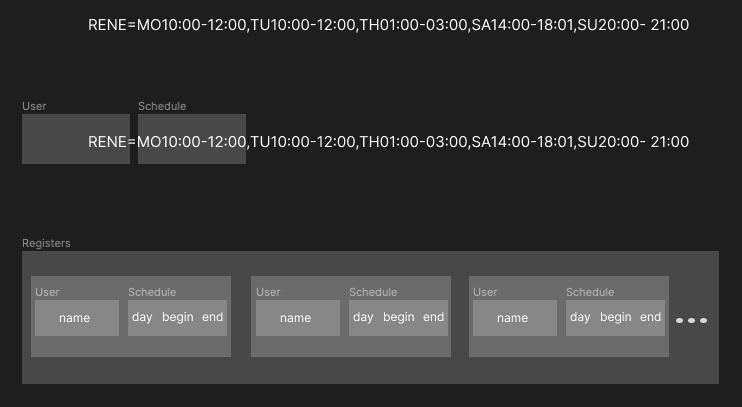

# ioet-challenge

## Analysis of solution
In the first part of the image, a data entry line is displayed at the top, here you can initially determine 3 classes, such as: User, Schedule, Register. Afterward, I declare the data input through the DataSource abstraction which is extended by FileSource. Finally to show the results Output class was created.


| Classes      | Description |
| :---        |    :----   |
| User        | To save the data of the user       |
| Schedule    | To save the object with day information.|
| Register    | To save the List of dictionary with User and schedule relation.|
| DataReader    | to load the data and save in User, Schedule and Register classes.|
| Output    | A class to show the data.|


&nbsp;




######  Directory Structure 

```
ioet-challenge
│   README.md
│   main.py    
│
└───classes
│   __init.py__
│   DataReader.py
│   Output.py
│   Register.py
│   Schedule.py
│   User.py
│
└───data
│   └───input
│   │   inputFile.txt
│   │
│   └───output
│       YYYYMMDD_HHMMSS.txt
│
└───src
│   └───images
│
└───tests
│   __init.py__
│   └───classes
│       __init.py__
│       test_schedule.py
│       test_user.py
│
└───utils
    __init.py__
    helpers.py
```

            
&nbsp;
### Code execution


###### Before of all, clone the repository
> git clone git@github.com:alvaroveloz/ioet-challenge.git
###### Then go to directory ioet-challenge
> cd ioet-challenge

###### Then save the input file data inside of the directory 
> /ioet-challenge/data/input

###### You can run the code typing in your console 
> python3 main.py

You are going to receive this message in console
```
Enter the name of the file to export content: 
```
Type the name of the input file, then you can see the table results in console. If you don't have any file, you can use either of the two files inside the /data/input 

```
2022-12-W1.txt
2022-12-W2.txt
```

&nbsp;
### Tests
To test classes I have been used Pytest
###### Test User Class
> pytest tests/classes/test_user.py -v
###### Test Schedule Class
> pytest tests/classes/test_schedule.py -v

